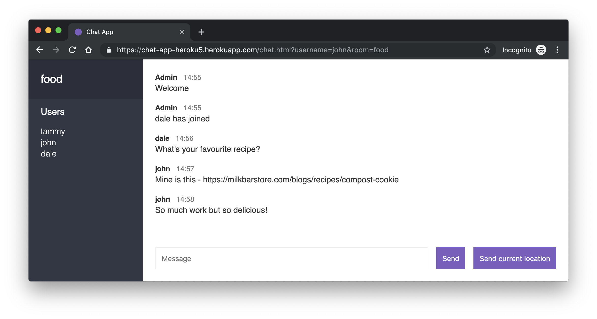

# Chat App



## Description
An application built with Node.js and Socket.io that allows people to chat in rooms in real time.

Try out the app hosted on Heroku at https://chat-app-heroku5.herokuapp.com
## Steps to setup and run the application
1. ```npm install``` to install the npm modules
2. ```npm start``` to run the application
